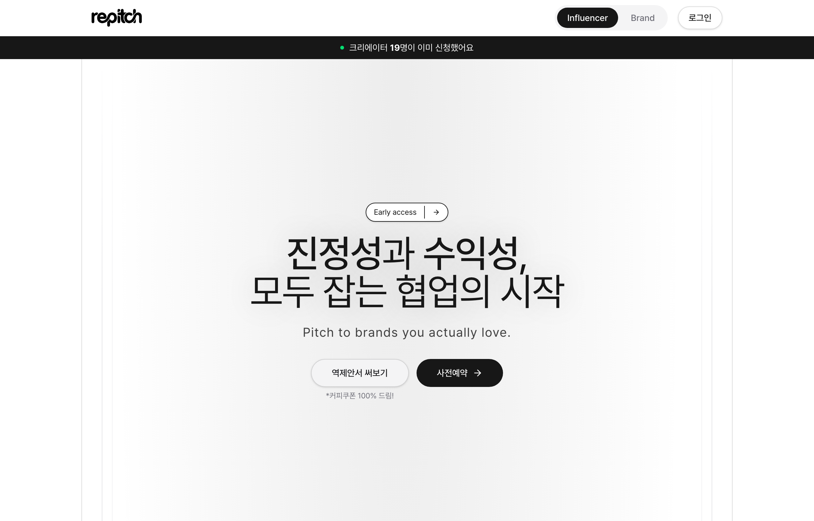
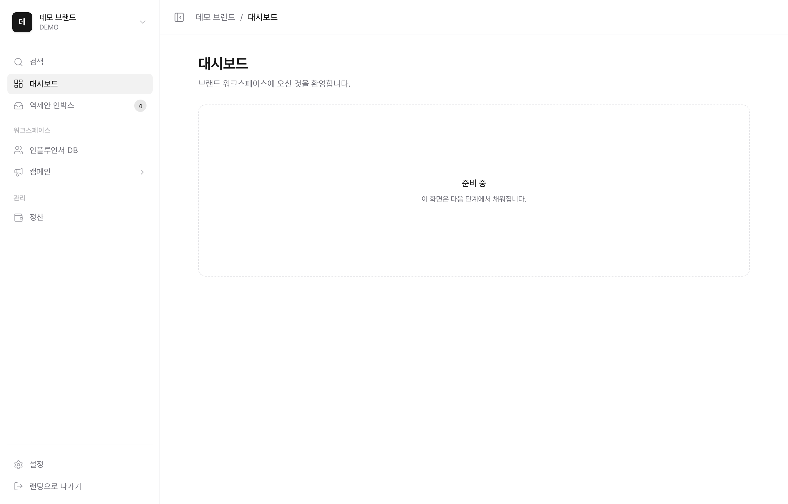

# repitch

**인플루언서가 먼저 제안하는 역매칭 플랫폼**

[](https://repitch.kr) &nbsp; Next.js · Supabase · Vercel

---

## 개요

repitch는 브랜드가 인플루언서를 찾는 기존 방향을 뒤집어, **인플루언서가 진짜 좋아하는 브랜드에 먼저 "역제안서"를 보내는** 협업 매칭 서비스입니다. 진정성 있는 매칭으로 광고 성과와 크리에이터의 지속가능성을 동시에 높이는 것을 목표로 합니다.

현재는 **정식 출시 전 사전 단계**로, 이 저장소는 랜딩페이지 · 리드(사전 신청) 수집 · 브랜드 워크스페이스(데모)를 포함합니다. 정식 매칭·평가 파이프라인은 설계를 마치고 단계적으로 구현 중입니다.



---

## ⭐ 개발 방식 — AI 에이전트 워크플로우

이 프로젝트의 차별점은 **결과물뿐 아니라 "만드는 방식"**에 있습니다. 전 기능을 직접 타이핑하는 대신, **AI 코딩 에이전트(Claude)에게 작업 명세를 설계·위임하고 산출물을 검증**하는 방식으로 구축했습니다. 사람은 요구사항 정의 · 명세 작성 · 리뷰/검증에 집중하고, 에이전트가 구현·마이그레이션·캡처 검증을 수행합니다.

- **명세 → 위임 → 검증 루프**: 기능별로 명세를 설계해 위임하고, 빌드·타입체크·브라우저 캡처로 결과를 확인한 뒤 반영.
- **Supabase MCP 서버 연동**: 에이전트가 MCP(Model Context Protocol)로 Supabase에 직접 연결해 **DB 스키마 생성 · 마이그레이션 적용 · 권한/정책 검증**을 수행합니다.
  - 작업 프로젝트로 **스코프 제한**, 작업 후 **read-only 재잠금** 등 권한을 관리하며 진행.
  - 에이전트가 `security definer` 함수·RLS 정책을 적용하고, `has_table_privilege` 등으로 권한을 직접 검증.
- **코드로 확인 가능한 근거**
  - `supabase/migrations/` — 역제안서 저장 테이블 마이그레이션(테이블 정의 + **RLS 정책** + GRANT 이중 방어).
  - 그 외 브랜드 입점·사전예약 테이블과 카운트용 RPC는 **MCP를 통해 원격 Supabase에 적용**(RLS·anon 권한 동일 패턴).
  - `lib/supabase/client.ts` — 환경변수 기반 anon 클라이언트(서버 키 미사용).

---

## AI · 평가 시스템 설계 *(설계 완료 / 구현 진행 중)*

역제안서의 "좋은 제안"을 정량화하기 위한 평가 체계를 설계했습니다. **아직 코드로 구현되지 않은 설계 단계**이며, 아래는 방향성입니다.

- **3축 지표 — Fit / Quality / Authenticity**: 브랜드-크리에이터 적합도, 제안 완성도, 진정성을 분리해 평가하는 지표 체계.
- **규칙 기반 v1 스코어링 → 학습 모델 로드맵**: 초기에는 명시적 규칙(하드 필터 + 가중 점수)으로 시작하고, 매칭 데이터가 축적되면 학습 기반 모델로 전환하는 단계적 접근.
- **LLM 기반 진정성 평가**: 제안 텍스트의 진정성을 판별하기 위한 프롬프트 설계 및 판별력 실험(정상/과장 샘플 구분) 계획.

> 라벨 데이터가 없는 초기 단계라, "규칙 기반 → 데이터 축적 → 학습 모델" 순서로 리스크를 줄이며 고도화하는 것을 원칙으로 합니다.

---

## 주요 기능

- **랜딩페이지** — 인플루언서/브랜드 **오디언스 토글**로 동일 페이지에서 두 타깃의 카피·섹션 전환. 상단에 **실시간 신청자 수 카운터**(Supabase RPC로 개수만 조회, 읽기 권한 없이 집계).
- **리드 수집 폼 3종** — 역제안서 작성(온보딩), 브랜드 사전 입점 신청, 이메일 사전예약. 각 폼은 **동의 기반 저장 + RLS 보안 설계**(anon은 동의된 행만 INSERT, 읽기 차단).
- **브랜드 워크스페이스(데모)** — 사이드바(워크스페이스 스위처 · 중첩 메뉴 · ⌘K 커맨드 팔레트 · 접기), 첫 진입 필터 설정 모달, 반응형 Dialog/Drawer 모달. *로그인 없는 데모 단계이며 각 화면은 준비 중입니다.*



---

## 기술 스택

| 영역 | 사용 기술 |
| --- | --- |
| 프론트엔드 | Next.js (App Router) · React · TypeScript |
| 스타일 | Tailwind CSS (모노톤 디자인 토큰, 라이트/다크 대응) |
| 백엔드/DB | Supabase — RLS · RPC(`security definer`) · **MCP 연동** |
| 배포 | Vercel ([repitch.kr](https://repitch.kr)) |

---

## 시작하기

```bash
# 1. 의존성 설치
npm install

# 2. 환경변수 설정 — 프로젝트 루트에 .env.local 생성 후 아래 두 값 입력
#    NEXT_PUBLIC_SUPABASE_URL=...
#    NEXT_PUBLIC_SUPABASE_ANON_KEY=...   (anon 공개 키만 사용, service_role 키 금지)

# 3. 개발 서버 실행
npm run dev   # http://localhost:3000
```

> Supabase 값이 없어도 UI는 확인할 수 있으나, 폼 저장·카운터 등 데이터 기능은 위 두 환경변수가 있어야 동작합니다.

---

## 프로젝트 구조

```
app/
  page.tsx              # 랜딩 (오디언스 토글)
  dashboard/            # 브랜드 워크스페이스(데모) — 레이아웃 + 하위 페이지
  opengraph-image.tsx   # OG 이미지 (next/og)
components/
  ui/                   # 랜딩 섹션, 모달(온보딩/사전예약/워크스페이스), 헤더 등
  dashboard/            # 대시보드 컨텍스트 · 필터 모달 등
lib/
  supabase/client.ts    # anon 클라이언트 (환경변수 기반)
  brand-application-options.ts  # 폼↔DB 공유 상수(카테고리 등)
supabase/
  migrations/           # DB 마이그레이션 (RLS 정책 포함)
```
